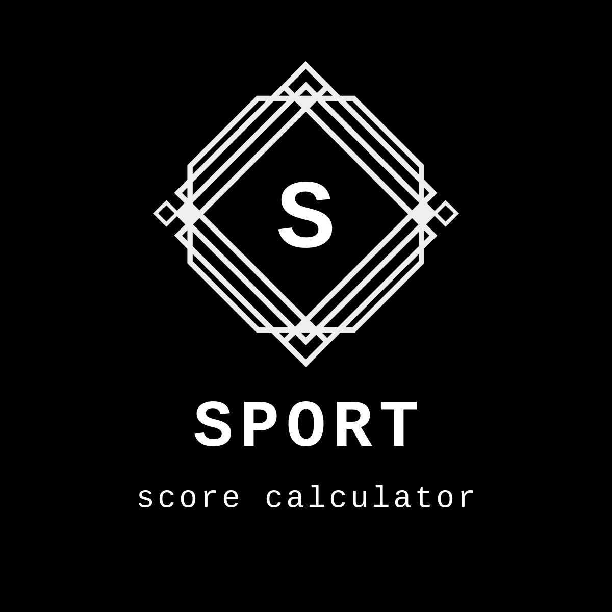

## SPoRT Score Calculator

*SPoRT* score is a scoring system to help determine whether conservative measures or surgery is required for the management of groin pain attributable to inguinal disruption. The scoring system was developed by Professor Aali Sheen and Dr. Hannu Paajanen in an international collaborative effort. For more info, click [here](https://2uphnw-sayan-biswas.shinyapps.io/SPoRT_score/).

This app allows you to calculate the SPoRT score with just a few clicks.

### Download

Download the app from the [App Store](https://apps.apple.com/us/app/sport-score-calculator/id6444921285).